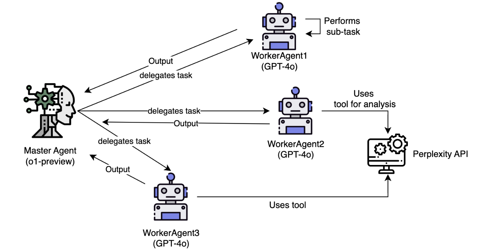

# Hive: A Multi-Agent Library for Complex Data Analysis

Hive is a powerful, multi-agent framework developed in Python, designed to facilitate complex workflows and automate data-driven tasks. While its architecture can be applied across various fields, this repository includes a comprehensive **Financial Data Analysis Tool** as a primary use case, demonstrating Hive's capabilities in a real-world scenario.

For more detailed insights and information about this project, check out my blog post on the same topic: [Read the Blog](https://www.ionio.ai/blog/building-an-agentic-framework-with-o1-and-gpt-4o)

## Table of Contents
- [Introduction](#introduction)
- [Architecture Overview](#architecture-overview)
- [Core Components](#core-components)
- [Setting Up the Project](#setting-up-the-project)
- [Usage](#usage)
- [Output Reference](#output-reference)
- [Future Development](#future-development)
- [Contributing](#contributing)
- [License](#license)

## Introduction

Hive streamlines the process of managing data-intensive tasks through a modular agentic architecture. By dividing responsibilities among specialized agents, Hive not only enhances efficiency but also adapts to a variety of applications. The **Financial Data Analysis Tool** serves as an example, enabling users to extract insights from stock market data seamlessly.

## Architecture Overview

To understand this agentic framework, let’s break down its architecture. Below is an architecture diagram that illustrates the interactions between the MasterAgent and Worker Agents:



### The MasterAgent

The MasterAgent serves as the brain of the system, leveraging OpenAI's advanced **O1** model to break down complex tasks into manageable sub-tasks. Unlike previous models, it employs an agentic approach that allows it to analyze the best way to tackle any question. This ensures the intelligent allocation of sub-tasks to Worker Agents, promoting smooth interactions and efficient collaboration.

When tasked with analyzing a company's long-term growth potential, the MasterAgent carefully selects the Worker Agents best suited for specific subtasks, such as examining financial statements, analyzing competitors, or investigating market trends. This strategic orchestration is crucial for generating comprehensive insights.

### The Worker Agents

Alongside the MasterAgent are the Worker Agents, which are essential for executing specific tasks. These agents utilize **GPT-4o** and other advanced tools to perform their jobs effectively. After completing their analyses, they return their findings to the MasterAgent.

Each Worker Agent is specialized for particular functions, like conducting market research, analyzing financial statements, or evaluating competitors. They gather relevant information quickly, drawing from various external sources to deliver insights that contribute to the MasterAgent's overall report.

This collaborative approach allows the MasterAgent and Worker Agents to work in harmony, focusing on their strengths and ultimately leading to valuable insights.

## Core Components

### 1. **`tools.py`**
   - Houses essential functions for data retrieval, agent interactions, and OpenAI API calls.
   - The `get_ticker_data()` function retrieves historical stock data using the `yfinance` library and saves it as a CSV file.

### Example of `get_ticker_data`:
```python
def get_ticker_data(ticker: str, period: str, filename: str) -> str:
    ticker_obj = yf.Ticker(ticker)
    try:
        hist = ticker_obj.history(period=period)
        subdirectory = f"Tickerdata/{ticker}"
        os.makedirs(subdirectory, exist_ok=True)
        filepath = os.path.join(subdirectory, filename)
        hist.to_csv(filepath)  # Save historical data to CSV
        return filepath  
    except Exception as e:
        print(f"Error fetching data: {e}")
        return None
```
Hive's Financial Data Analysis Tool automates the extraction of insights from stock market data. It utilizes the yfinance library to pull historical stock data for a specified company over the past year, which is then processed and analyzed using the OpenAI API.

### 2. **`main.py`**
   - Contains the entry point for running the analysis.
   - Execute the `MasterAgent()` to perform analysis by entering the company name as a parameter.
### Running the Analysis:
```python
if __name__ == "__main__":
    master_agent = MasterAgent()
    master_agent.run("JPMorganChase")  # Replace with any company name
```

## Setting Up the Project
### 1. Clone the repository:
```bash
git clone https://github.com/Ionio-io/O1-Agents
cd O1-Agents
```

### 2. Install required packages:

```bash
pip install -r requirements.txt
```
### 3. Set up the .env file with necessary API keys.

## Usage

To analyze a company, follow these steps:

### 1. In main.py, instantiate the MasterAgent and call the run() method with a company name.
### 2. The output report will be generated in report.md, which can be rendered to PDF for review.

#### Example:
```python
from main import MasterAgent

master_agent = MasterAgent()
master_agent.run("Meta")
```
## Output Reference
#### The generated report will include
1. Historical performance graphs
2. Key metrics summary
3. Hypotheses regarding future trends

For a visual reference of the output generated by the **Hive** agentic library, you can view the sample report in the following PDF:

[Download Sample Report](path/to/your/sample_report.pdf)

## Future Development
Future features may include:

 1. Customizable agent modules for broader applications.
 2. Enhanced AI models for improved data interpretation and forecasting.
 3. A user-friendly interface for managing agent workflows.

## Contributing

Contributions are welcome! To contribute:

1. Fork the repository.
2. Create a new branch for your feature or bug fix.
3. Submit a pull request with a clear description of your changes.

## License

This project is licensed under the Apache 2.0 License. See the `LICENSE` file for more details.
```
Copyright 2024 Ionio

Licensed under the Apache License, Version 2.0 (the "License");
you may not use this file except in compliance with the License.
You may obtain a copy of the License at

    http://www.apache.org/licenses/LICENSE-2.0

Unless required by applicable law or agreed to in writing, software
distributed under the License is distributed on an "AS IS" BASIS,
WITHOUT WARRANTIES OR CONDITIONS OF ANY KIND, either express or implied.
See the License for the specific language governing permissions and
limitations under the License.
```
