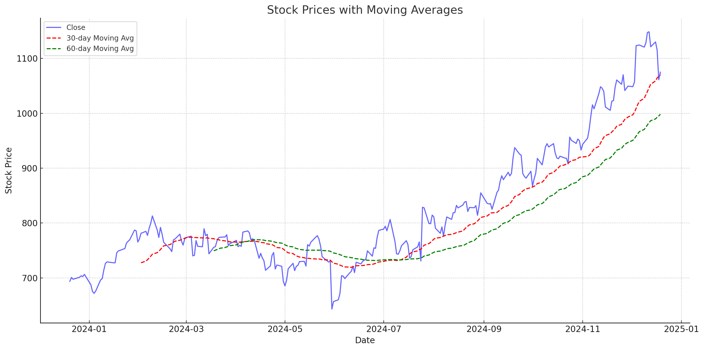

### Goldman Sachs Long-Term Growth Analysis Report

**Introduction**

Goldman Sachs, a leading global investment bank and financial services company, has demonstrated resilience and strategic agility amid fluctuating economic conditions from 2018 to 2023. This report provides a comprehensive analysis of Goldman Sachs' financial performance, market positioning, competitive landscape, regulatory environment, and industry trends to assess its long-term growth potential.

---

**1. Financial Performance (2018-2023)**

Goldman Sachs' financial trajectory from 2018 to 2023 showcases significant fluctuations influenced by both internal strategies and external economic factors.

- **Revenue Trends:**
  
  From 2018 to 2023, Goldman Sachs experienced varying revenue growth rates. In 2018, annual revenue was $36.62 billion, increasing by 11.87% from the previous year. This growth slowed in 2019 with a slight decline to $36.55 billion. The company rebounded in 2020 with a substantial increase to $44.56 billion and continued this upward trend in 2021, reaching $59.34 billion. However, revenues decreased to $47.37 billion in 2022 before a modest recovery to $45.23 billion in 2023.
  
  
  
  *The image above illustrates the revenue trends of Goldman Sachs from 2018 to 2023, highlighting the significant growth in 2020 and 2021, followed by a decline in 2022 and a slight recovery in 2023.*

- **Net Income and Earnings Per Share (EPS):**
  
  Net income and EPS followed a similar pattern. After a dip in 2019, net income surged in 2020 and peaked in 2021 before declining in the subsequent years. EPS mirrored these trends, indicating volatility in profitability.

- **EBIT and Margins:**
  
  Earnings Before Interest and Taxes (EBIT) and EBIT margins showed robust growth until 2021, after which both metrics declined in 2022 and 2023. This fluctuation reflects changes in operational efficiency and market conditions.

- **Book Value and Dividends:**
  
  The book value per share consistently increased from $218.5 in 2019 to $313.6 in 2023. Additionally, the quarterly dividend per share more than tripled, rising from $4.15 in 2019 to $10.50 in 2023, underscoring Goldman Sachs' commitment to shareholder returns.

- **Market Rankings and Positions:**
  
  Despite financial fluctuations, Goldman Sachs maintained strong market positions. In 2023, the firm was ranked #1 in Advisory net revenues for the 21st consecutive year and held top positions in various market segments, reflecting its enduring market strength.

---

**2. Detailed Financial Analysis (2023)**

A closer examination of Goldman Sachs' 2023 financial statements provides deeper insights into its operational and financial health.

- **Income Statement:**
  
  In 2023, Goldman Sachs reported net revenues of $46.25 billion and net earnings of $8.52 billion. The Global Banking & Markets division saw an 8% decrease in net revenues, while the Asset & Wealth Management segment experienced a 4% increase, driven by higher management fees and increased assets under supervision.

- **Balance Sheet:**
  
  Total assets grew to $1.20 trillion, with significant increases in collateralized agreements and cash equivalents. However, shareholder's equity saw a slight decrease due to note repurchases and dividend payments. The Common Equity Tier 1 (CET1) capital ratio remained robust at 12.6%.

- **Cash Flow Statement:**
  
  The cash flow statement revealed challenges, with a free cash flow of -$11.625 billion and a net cash flow of -$85.190 billion. Negative operating and investing cash flows were partially offset by positive financing activities.

---

**3. Hypothesis and Quantitative Analysis**

Goldman Sachs' stock performance was analyzed through two main hypotheses:

1. **Moving Average Crossover as a Signal:**
   
   - **Findings:** Bullish crossovers (10-day MA crossing above 50-day MA) coincided with stock price increases in 121 instances, supporting their effectiveness as indicators of upward trends. Bearish crossovers were less frequent but indicated potential downtrends.
   
   - 
   
   *This visualisation shows the stock closing prices along with 10-day and 50-day moving averages, highlighting potential trend indicators.*

2. **Volume Spikes Preceding Price Change:**
   
   - **Findings:** The correlation between volume spikes and subsequent price changes was inconclusive due to data insufficiencies. However, significant volume increases aligned with major price changes suggest potential predictive signals.

   
   
   *This bar chart illustrates the trading volume over time, showing how volume spikes often correlate with significant stock price movements.*

**Conclusion:**
  
The moving average crossover strategy appears effective for predicting upward stock trends. While volume spike analysis showed inconclusive results, further exploration with more comprehensive data is recommended.

---

**4. Market Research**

The financial services industry in 2023 is characterized by rapid digital transformation, adoption of emerging technologies, and a focus on sustainability.

- **Digital Transformation:**
  
  Institutions are increasingly leveraging online banking, mobile apps, and cloud-native systems to enhance customer experience and operational efficiency.

- **Emerging Technologies:**
  
  Artificial Intelligence (AI) and Machine Learning (ML) are pivotal in risk management, regulatory compliance, and personalized customer services. Investment in AI by the banking sector reached $20.6 billion in 2023.

- **New Payment Methods:**
  
  The rise of contactless payments, cryptocurrencies, and blockchain-based transactions is revolutionizing financial services delivery.

- **Sustainability Initiatives:**
  
  Carbon offset financing and sustainable financial products are becoming integral as consumer and regulatory demands for environmentally responsible practices increase.

- **Customer-Centricity:**
  
  Enhanced user experiences through personalized services and seamless digital interactions are driving customer loyalty and engagement.

**Growth Opportunities for Goldman Sachs:**
  
Goldman Sachs can capitalize on AI and ML applications, sustainability initiatives, and fintech collaborations to foster long-term growth and maintain its competitive edge in the evolving financial landscape.

---

**5. Competitor Analysis**

Goldman Sachs operates in a highly competitive environment with several key players:

- **JPMorgan Chase:**
  
  With revenues of $127.2 billion in 2023, JPMorgan Chase outperforms Goldman Sachs significantly. Its diversified services, digital and physical expansion, and commitment to sustainability bolster its market dominance.

- **Morgan Stanley:**
  
  Excelling in wealth and asset management, Morgan Stanley focuses on sustainability, aiming to mobilize $1 trillion for sustainable solutions by 2030. Its integrated, client-centric approach positions it as a strong competitor.

- **European Competitors:**
  
  Credit Suisse and Deutsche Bank maintain significant market shares in private banking and investment banking, respectively, especially in emerging markets.

- **Boutique Investment Banks:**
  
  Firms like Evercore and Lazard specialize in M&A and restructuring advisory, often outperforming larger banks in specific sectors.

- **Fintech Disruptors:**
  
  Companies like Robinhood and SoFi pose long-term threats with their tech-forward approaches and appeal to younger demographics.

**Strategic Implications:**
  
Goldman Sachs must continue to innovate and diversify its service offerings to stay competitive. Emphasizing digital transformation, sustainability, and strategic partnerships with fintech firms will be crucial for maintaining its market position.

---

**6. Regulatory Environment**

Goldman Sachs navigates a complex regulatory landscape with several key developments impacting its operations:

- **Basel III Endgame Proposal:**
  
  Introduced in July 2023, this proposal increases capital requirements for large banks, including Goldman Sachs. The firm opposes these changes, arguing they could restrict credit availability for small businesses and shift activities to non-bank entities, potentially increasing financial instability.

- **EU Investment Firms Regulation (IFR) and Investment Firms Directive (IFD):**
  
  Set to take effect on March 31, 2024, these regulations introduce a tailored prudential regime for investment firms, focusing on capital requirements and risk management. Goldman Sachs must adapt its operations to ensure compliance.

- **Enforcement Actions:**
  
  In August 2023, the Commodity Futures Trading Commission (CFTC) fined Goldman Sachs $5.5 million for inadequate recordkeeping related to mobile device calls and trading activities during the COVID-19 pandemic. This highlights the importance of robust compliance measures.

- **Resolution Planning:**
  
  Goldman Sachs has engaged in resolution planning to ensure orderly resolution in the event of financial distress, addressing regulatory feedback to enhance governance and operational practices.

**Strategic Response:**
  
To navigate these regulatory challenges, Goldman Sachs must enhance its compliance infrastructure, engage proactively with regulators, and implement strategic initiatives to mitigate potential adverse impacts on its operations and market positioning.

---

**Conclusion**

Goldman Sachs has demonstrated resilience and strategic foresight amidst fluctuating financial performance and a dynamic regulatory and competitive landscape. The company's strong market positions, commitment to innovation, and focus on sustainable growth provide a solid foundation for long-term success. However, ongoing challenges related to regulatory compliance, competitive pressures, and economic uncertainties necessitate continuous adaptation and strategic agility. As Goldman Sachs leverages emerging technologies, expands its service offerings, and navigates regulatory changes, it is well-positioned to sustain its growth and maintain its leadership in the global financial services industry.